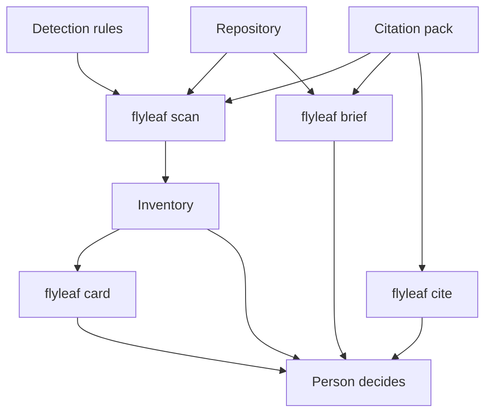
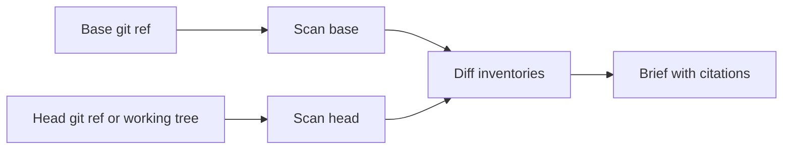
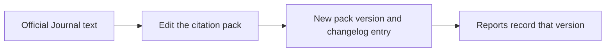

# flyleaf


flyleaf is a local documentation clerk for AI code. It inventories the AI libraries in a repository, cites the EU AI Act provisions a person should read, and reports when a model card is missing or has fallen behind the code.

A flyleaf is the blank page bound in front of a book, the page where you say what the book is. This tool prepares that page and keeps a record of when the book moves on.

Legal classification depends on the use case. The use case is not in the import. flyleaf prepares the inventory and the questions. A person decides what the law requires. This output is not legal advice.

## Architecture

Detection rules and the citation pack are separate. The scanner names what it found in the tree. The pack names the provision to read, the Official Journal text, and the date that text was current. Every report copies the pack version, so a later edit to the pack does not rewrite an older run.



`brief` scans the same rules at two revisions and diffs the inventories. Line numbers can move without a finding. A finding appears when a component is added or removed, when the import or dependency text changes, or when the model card content changes.



The pack moves only when you publish a new version. A scan does not fetch the law.



## What a component is

A component is one detected framework in one file: `app.py` importing `openai`, or `pyproject.toml` depending on `scikit-learn`. That is evidence. An AI system is a grouping a person makes from those components. flyleaf does not invent that grouping, and it does not assign a risk tier.

Status values on a finding are `missing` and `needs_review`. `missing` means a model card file was not found, or was removed. `needs_review` means a person should read the cited provision against the change. The tool does not declare that a law was breached.

## Install

```bash
uv sync
uv run flyleaf --help
```

## Scan

```bash
uv run flyleaf scan .
uv run flyleaf scan . --format markdown
uv run flyleaf scan . -o inventory.json
```

`scan` exits 0 when it finishes, including when it finds AI libraries. Using PyTorch is not a failed build.

Python files are read with the standard-library AST. `requirements*.txt`, `pyproject.toml`, and `package.json` are read as dependency lists. JavaScript imports inside `.ts` and `.js` files are not parsed yet. Scoped packages such as `@anthropic-ai/sdk` are recognized when they appear in `package.json`.

A model card counts as present when `MODEL_CARD.md` (or `model_card.md` / `modelcard.md`, markdown or yaml) sits next to the file or at the repository root.

JSON is the default. Every inventory includes:

- `citation_pack.version` and `citation_pack.as_of`
- `citations`, the entries this report actually used, each with pinpoint, quote, note, CELEX, and source URL
- `components[]` with `path`, `framework`, `category`, `role_hint`, `evidence`, `review_hints`, `model_card_status`, and `documentation_citation_ids`
- a disclaimer
- `warnings` for files that could not be parsed

`role_hint` is one of `api_client`, `orchestration`, or `local_ml`. It tells you which definition to read. It is not a finding that you are a provider or a deployer.

## Brief

```bash
uv run flyleaf brief main~1
uv run flyleaf brief v0.1.0 HEAD --format markdown
```

The first form compares a git ref with the working tree. The second compares two refs. `brief` exits 0 when the diff finishes, including when it finds gaps. It exits 2 when the path is not a git repository or the ref does not resolve.

A quiet brief means no component was added or removed, no detected evidence text changed, and no model card content changed. An unchanged missing card stays in `scan`. `brief` reports the delta.

## Card

```bash
uv run flyleaf card . -o flyleaf-cards
```

This writes one markdown scaffold per component. The file is a draft with blanks for purpose, role, data, limitations, oversight, and the Annex III use case. Existing scaffolds are kept unless you pass `--force`. The scaffolds are not named `MODEL_CARD.md`, so they do not count as present until a person places a card under one of the names above.

## Cite

```bash
uv run flyleaf cite
uv run flyleaf cite art-11-annex-iv
uv run flyleaf cite --changelog
```

The current pack is `2026.07.27`. It cites Regulation (EU) 2024/1689 (CELEX `32024R1689`) as amended by Regulation (EU) 2026/1744 (CELEX `32026R1744`), in force 27 July 2026. The amendment deferred Chapter III, Sections 1, 2, and 3: 2 December 2027 for Annex III systems, and 2 August 2028 for Annex I systems. That date is citation `art-113-application`.

To record a later change in the law:

1. Edit `src/flyleaf/citations.py`.
2. Keep a superseded entry in place when a quote is replaced, and point the hint at the new id.
3. Bump `PACK_VERSION` and add a `CHANGELOG` line that names which hint ids a person should re-read.

## What it detects

Hosted model clients: OpenAI, Anthropic, Google GenAI, Mistral, Cohere.

Orchestration: LangChain, LlamaIndex, LangGraph.

Machine learning: PyTorch, TensorFlow, scikit-learn, Transformers, XGBoost.

## Privacy

Scanning reads the local tree and, for `brief`, local git history. There is no telemetry, no account, and no network call.
