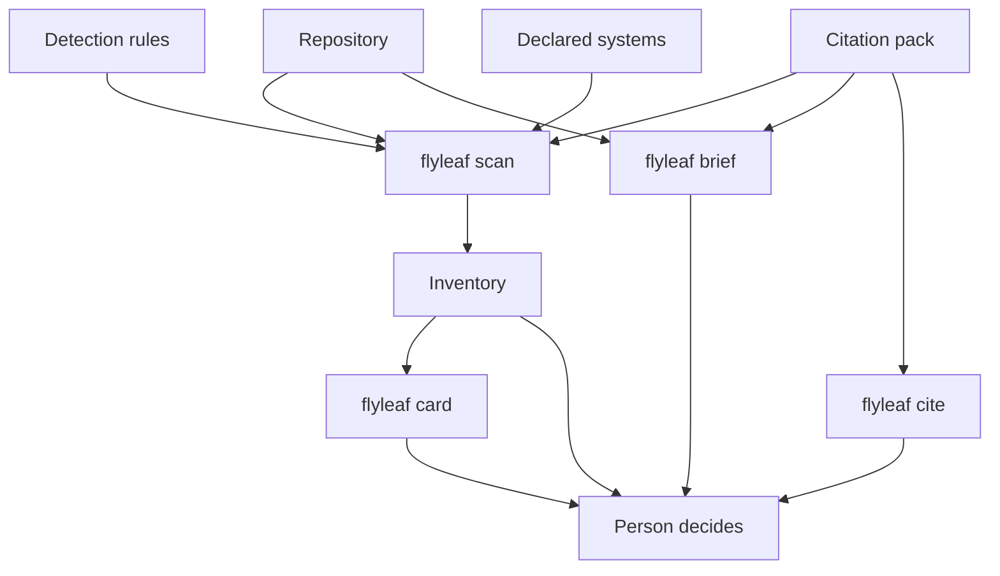
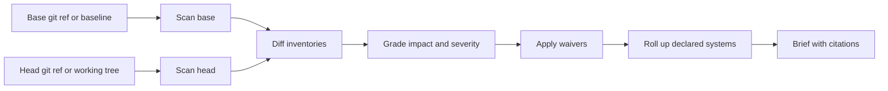
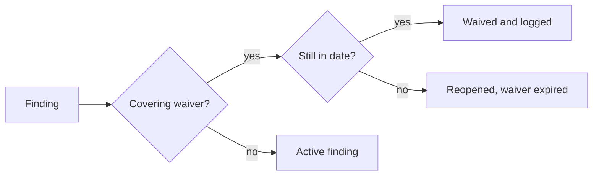
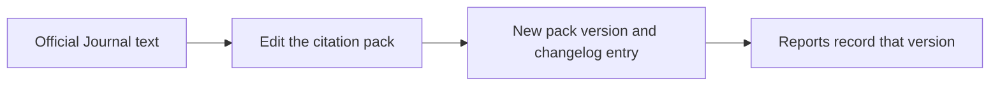
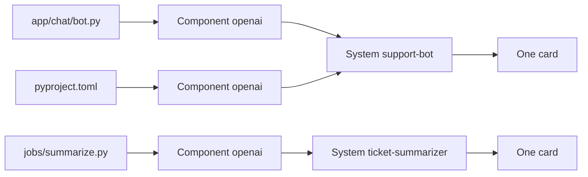
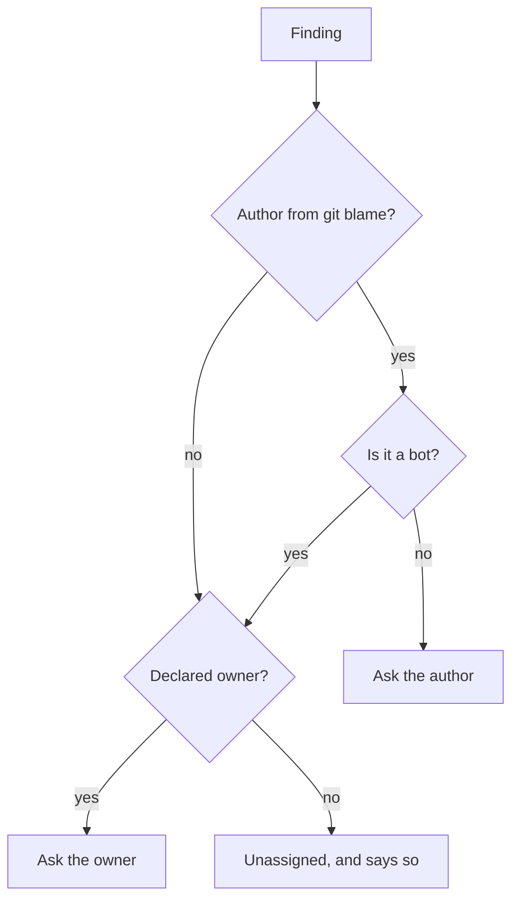

# flyleaf

[](https://github.com/krishyaid-coder/flyleaf/actions/workflows/ci.yml)
[](https://pypi.org/project/flyleaf/)
[](https://pypi.org/project/flyleaf/)
[](LICENSE)

<p align="center">
  
</p>

flyleaf is a local documentation clerk for AI code. It inventories the AI libraries in a repository, cites the EU AI Act provisions a person should read, and reports when a model card is missing or has fallen behind the code.

A flyleaf is the blank page bound in front of a book, the page where you say what the book is. This tool prepares that page and keeps a record of when the book moves on.

Legal classification depends on the use case. The use case is not in the import. flyleaf prepares the inventory and the questions. A person decides what the law requires. This output is not legal advice.

<p align="center">
  
</p>

## Architecture

Detection rules and the citation pack are separate. The scanner names what it found in the tree. The pack names the provision to read, the Official Journal text, and the date that text was current. Every report copies the pack version, so a later edit to the pack does not rewrite an older run.



`brief` scans the same rules at two states and diffs the inventories. Line numbers can move without a finding. A finding appears when a component is added or removed, when the import or dependency text changes, or when the model card content changes. The base is a git ref, or the recorded baseline.



Waivers are applied to components first, then to systems, so a waiver on one file shrinks a system finding rather than silencing it.

A waiver suppresses a finding for a stated reason, until a stated date. It is never silent and never permanent. An expired waiver puts the finding back in front of a person.



The pack moves only when you publish a new version. A scan does not fetch the law.



## What a component is

A component is one detected framework in one file: `app.py` importing `openai`, or `pyproject.toml` depending on `scikit-learn`. That is evidence. An AI system is a grouping a person makes from those components. flyleaf does not invent that grouping, and it does not assign a risk tier.

You can declare the grouping yourself. See Systems below. Once declared, a system is what the brief reports and what `card` scaffolds, so one system needs one card rather than one per file.

Status values on a finding are `missing` and `needs_review`. `missing` means a model card file was not found, or was removed. `needs_review` means a person should read the cited provision against the change. The tool does not declare that a law was breached.

## Impact and severity

Every finding carries an impact and a severity.

`impact` is `runtime` when the detected code changed, and `documentation` when only the model card did. A new dependency behaves differently from a reworded card, so the two are not mixed.

`severity` is `high`, `medium`, or `low`. It ranks how much engineering attention a change deserves. It is not a legal risk tier and says nothing about whether an obligation applies.

| Change | Impact | Severity |
|---|---|---|
| `added` with no model card | runtime | high |
| `added` with a model card | runtime | medium |
| `removed` | runtime | medium |
| `evidence_changed` | runtime | high |
| `card_stale` | runtime | high |
| `evidence_and_card_changed` | runtime | medium |
| `card_removed` | documentation | high |
| `card_added` | documentation | low |
| `card_changed` | documentation | low |

A system finding takes the severity of its worst component, and its impact is `runtime` when any component inside it changed code.

## Install

```bash
uv tool install flyleaf
flyleaf --help
```

`pipx install flyleaf` and `pip install flyleaf` work too. Python 3.11 or later. The only runtime dependency is typer.

To work on flyleaf itself:

```bash
git clone https://github.com/krishyaid-coder/flyleaf
cd flyleaf
uv sync
uv run pytest
```

## Scan

```bash
uv run flyleaf scan .
uv run flyleaf scan . --format markdown
uv run flyleaf scan . -o inventory.json
```

`scan` exits 0 when it finishes, including when it finds AI libraries. Using PyTorch is not a failed build.

Python files and code cells in `.ipynb` notebooks are read with the standard-library AST. `requirements*.txt`, `pyproject.toml`, and `package.json` are read as dependency lists. A keyword that happens to match a package name is not treated as a dependency. JavaScript imports inside `.ts` and `.js` files are not parsed yet. Scoped packages such as `@anthropic-ai/sdk` are recognized when they appear in `package.json`.

A model card counts as present when `MODEL_CARD.md` (or `model_card.md` / `modelcard.md`, markdown or yaml) sits next to the file or at the repository root. A component in a declared system uses that system's card instead.

JSON is the default. Every inventory includes:

- `citation_pack.version` and `citation_pack.as_of`
- `citations`, the entries this report actually used, each with pinpoint, quote, note, CELEX, and source URL
- `components[]` with `path`, `framework`, `category`, `role_hint`, `system`, `evidence`, `review_hints`, `model_card_status`, and `documentation_citation_ids`
- `systems[]`, the groupings you declared, each with its owner, card status, and component ids
- a disclaimer
- `warnings` for files that could not be parsed

`role_hint` is one of `api_client`, `orchestration`, or `local_ml`. It tells you which definition to read. It is not a finding that you are a provider or a deployer.

## Systems

One library used in three files is three components. Whether it is one system or three depends on who the output reaches and what for, and that is not in the import. flyleaf will not guess it, so you declare it in `.flyleaf/systems.toml`. Commit that file.

```toml
[[system]]
name = "support-bot"
owner = "platform@example.com"
card = "docs/cards/support-bot.md"
includes = ["app/chat/*", "pyproject.toml"]

[[system]]
name = "ticket-summarizer"
owner = "support@example.com"
card = "docs/cards/ticket-summarizer.md"
includes = ["jobs/summarize.py"]
```

`name` and `includes` are required. `card` and `owner` are optional. An entry missing a required field is ignored, reported as a warning, and its files fall back to standing alone.

An include is an exact path, a glob, or a directory prefix, all relative to the repository root and written with forward slashes. A `*` spans separators, so `app/*` claims everything beneath `app`. A file claimed by two systems goes to the first one declared, and the scan warns that it was contested. A system that claims no detected component also warns, because that usually means a pattern is wrong.



Declaring a system changes three things. The declared `card` becomes the card for every component in the system, so one file documents the whole thing. The brief reports one finding per system instead of one per file, listing the components inside it as evidence. `flyleaf card` writes one scaffold per system.

Components you do not claim are still reported individually. Nothing is hidden by leaving the file out.

## Who owns a finding

A finding that names nobody is a finding nobody does. Every finding in a brief carries two names, and they answer different questions.

`owner` is the `owner` field of the declared system. It is accountable for the system whoever happened to type the change.

`author` is read from `git blame` on the evidence line that changed. It is whoever last touched that line, which is usually the person who can answer the question fastest.



The brief opens with a "Who should look at this" section grouping the findings by person. A bot is never asked to review, so a Dependabot bump falls through to the declared owner. An uncommitted edit has no author yet and says so rather than guessing. A finding with neither name reads `unassigned`, which is a true statement about your repository and not a gap in the tool.

Blame names a line, not a fault. A reformat, a file move, or a bulk upgrade will put the wrong name on a finding, so the report always says where the name came from. Pass `--no-blame` to leave authors out entirely, for example if you would rather not have committer emails in a report that leaves the repository.

## Brief

```bash
uv run flyleaf brief main~1
uv run flyleaf brief v0.1.0 HEAD --format markdown
uv run flyleaf brief --baseline
```

The first form compares a git ref with the working tree. The second compares two refs. The third compares the working tree against the approved baseline. `brief` exits 2 when the path is not a git repository, the ref does not resolve, or no baseline has been recorded.

A quiet brief means no component was added or removed, no detected evidence text changed, and no model card content changed. An unchanged missing card stays in `scan`. `brief` reports the delta.

## Baseline

A baseline is the inventory as it stood at the last sign-off.

```bash
uv run flyleaf baseline --approved-by you@example.com --rev v1.2.0
uv run flyleaf brief --baseline
```

This writes `.flyleaf/baseline.json`. Commit it. Drift is then measured against an approved state rather than an arbitrary pair of commits, and the brief records who approved it and when.

## Waivers

A finding is suppressed only by a written waiver in `.flyleaf/waivers.toml`. Commit that file too. It is the audit trail.

```toml
[[waiver]]
component = "app.py:openai"
reason = "Internal prototype, not shipped. Card lands with the 1.3 release."
approved_by = "you@example.com"
expires = "2026-12-31"

[[waiver]]
component = "notebooks/train.ipynb:torch"
change = "card_stale"
reason = "Card rewrite tracked in issue 42."
approved_by = "you@example.com"
expires = "2026-11-15"
```

`component`, `reason`, `approved_by`, and `expires` are all required. An entry missing any of them is ignored, reported as a warning, and the finding stays active. Omit `change` to cover every change on that component, or name one change to be narrower.

To waive a whole declared system, name it as `system:<name>`:

```toml
[[waiver]]
component = "system:support-bot"
reason = "Card rewrite tracked in issue 42."
approved_by = "you@example.com"
expires = "2026-11-15"
```

A waived finding is not deleted. It moves to the `waived` list in the output, with the reason, the approver, the expiry date, and the days remaining. When the date passes, the finding returns to `findings` with `waiver_state` set to `expired`, and the summary names the lapsed waiver. A waiver inside 14 days of expiry raises a warning so renewal is not a surprise.

## Continuous integration

```bash
uv run flyleaf brief --baseline --fail-on high --format sarif -o flyleaf.sarif
```

`--fail-on` takes `none`, `low`, `medium`, or `high`, and defaults to `none`. The command exits 1 when an active finding reaches that severity, and 0 otherwise. Waived findings never trigger the exit code. A team picks its own policy, for example failing on runtime drift while only warning on documentation changes.

`--format sarif` writes SARIF 2.1.0, so GitHub renders the findings as annotations on the pull request. High maps to `error`, medium to `warning`, and low to `note`.

On GitHub, use the action:

```yaml
permissions:
  contents: read
  pull-requests: write
  security-events: write

steps:
  - uses: actions/checkout@v7
    with:
      fetch-depth: 0
  - uses: krishyaid-coder/flyleaf@v0.5.0
    id: flyleaf
    with:
      baseline: "true"
      fail-on: high
  - uses: github/codeql-action/upload-sarif@v3
    if: always()
    with:
      sarif_file: ${{ steps.flyleaf.outputs.sarif-file }}
```

The action posts the brief as a pull request comment and edits that same comment on every later push, because a fresh comment per push is how a review bot teaches people to scroll past it. Set `comment: "false"` to turn it off. It needs `pull-requests: write`.

Every artefact is produced before the severity threshold is applied, so a failing check still leaves the comment and the annotations behind for the author to read.

`fetch-depth: 0` gives the action the history it needs for `git blame` and for comparing two refs. Without it, authors come back unknown.

SARIF annotations through `upload-sarif` are free on public repositories but need GitHub Advanced Security on private ones. The pull request comment works everywhere, which is why the action posts one rather than relying on annotations alone.

Pass `base` and `head` instead of `baseline` to compare two refs.

## Render

```bash
uv run flyleaf brief --baseline --format json -o brief.json
uv run flyleaf render brief.json --format markdown
uv run flyleaf render brief.json --format sarif -o brief.sarif
```

`render` re-renders a saved report without scanning or reading git, so a pipeline that wants three formats pays for one scan, and an archived brief can be read back long after the branch is gone.

## Card

```bash
uv run flyleaf card . -o flyleaf-cards
```

This writes one markdown scaffold per declared system, then one per component that no system claimed. The file is a draft with blanks for purpose, role, data, limitations, oversight, and the Annex III use case. A system scaffold lists every component inside it so the evidence is in one place. Existing scaffolds are kept unless you pass `--force`.

Scaffolds land under `--output` and never at a declared `card` path, so an empty draft is never counted as documentation. Move the file into place once it says something. A per-component scaffold has to be renamed to `MODEL_CARD.md` to count.

## Cite

```bash
uv run flyleaf cite
uv run flyleaf cite art-11-annex-iv
uv run flyleaf cite --changelog
```

The current pack is `2026.07.27`. It cites Regulation (EU) 2024/1689 (CELEX `32024R1689`) as amended by Regulation (EU) 2026/1744 (CELEX `32026R1744`), in force 27 July 2026. The amendment deferred Chapter III, Sections 1, 2, and 3: 2 December 2027 for Annex III systems, and 2 August 2028 for Annex I systems. That date is citation `art-113-application`.

To record a later change in the law:

1. Edit `src/flyleaf/citations.py`.
2. Keep a superseded entry in place when a quote is replaced, and point the hint at the new id.
3. Bump `PACK_VERSION` and add a `CHANGELOG` line that names which hint ids a person should re-read.

## What it detects

Hosted model clients: OpenAI, Anthropic, Google GenAI, Mistral, Cohere.

Orchestration: LangChain, LlamaIndex, LangGraph.

Machine learning: PyTorch, TensorFlow, scikit-learn, Transformers, XGBoost.

## Known limits

Detection is Python and notebooks only. TypeScript and JavaScript source files are not parsed, though their dependencies are read from `package.json`.

A component is one framework in one file, so a dependency entry and the import that uses it are two components. Declare a system to group them. Without a declaration they stay separate, because the grouping is a human judgement and flyleaf does not guess it.

A declared system is only as good as its `includes` patterns. A new file that no pattern covers is reported as a loose component, not quietly added to the nearest system.

`brief` compares the text of detected evidence, not line numbers, so moving code does not raise a finding. A change elsewhere in a manifest does not raise one either. A rename does count as a removal plus an addition.

## Privacy

Scanning reads the local tree and, for `brief`, local git history including `git blame`. There is no telemetry, no account, and no network call. The GitHub Action is the one place anything is sent anywhere, and it posts to your own repository with your own token. Use `--no-blame` to keep committer names out of a report.
